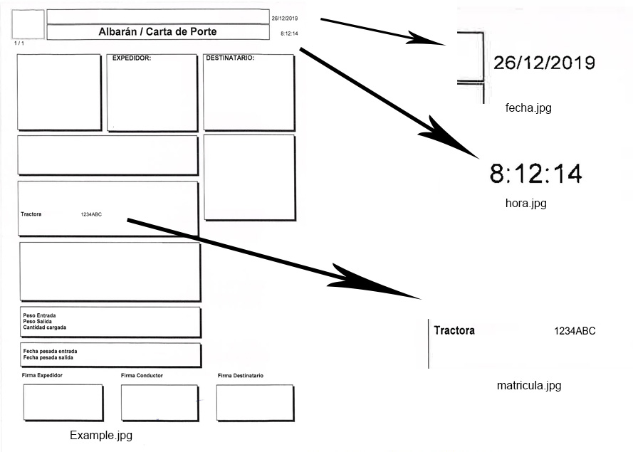

# Organizador de Albaranes

_Este proyecto está realizado para una empresa en particular, pero tratare de explicar como modificarlo para poder hacer uso en otras circunstancias._

## Comenzando 🚀

Este script permite ejecutarse tanto en Ubuntu como en Windows, en Windows será necesario tener en configuration.json el path de Tesseract y Poppler. Mas información de la descarga en **Deployment**

Resumen de cada uno de los Scripts:
 - [gmailAPI_pdf.py](gmailAPI_pdf.py) Se encarga de descargar mediante la API de Gmail los PDF adjuntos a los correos no leídos, para esto es necesario crear el token y conectar una cuenta. (Mas info en **Pre-requisitos**) 
 - [organiza.py](organiza.py) recibe un pdf, lo convierte a imagen y lo ordena en las carpetas correspondientes
 - [main.py](main.py) se encarga de llamar a gmailAPI_pdf.py, convertir cada PDF en un PDF por hoja y mandárselos a organiza.py

En el caso probado, necesitábamos seleccionar la fecha, hora y la matricula del Albarán para usarlos como información de cara a ordenarlo, por lo que transformamos el pdf a imagen y de ahí "recortamos" las zonas necesarias y aplicamos el OCR en esos recortes. 
De cara a obtener correctamente las áreas a analizar se puede hacer uso de [testRecorte.py](TEST/testRecorte.py)

### Pre-requisitos 📋

* [PyPDF2](https://pypi.org/project/PyPDF2/) - Para trabajar con PDFs
* [Pillow](https://pypi.org/project/Pillow/) - Trabajar con imágenes
* [Pytesseract](https://pypi.org/project/pytesseract/) - OCR (Necesario instalar Tesseract-OCR en Windows info en **Deployment**)
* [pdf2image](https://pypi.org/project/pdf2image/) - Convertir pdfs a imagen (Es necesario instalar poppler, Windows info en **Deployment**)
* [GoogleAPI](https://developers.google.com/docs/api/quickstart/python) - Enlace al Quickstart para aprender lo basico
* [Progress](https://pypi.org/project/progress/) - Barra de progreso para parecer profesionales

Mas info en [requirements](requirements.txt)

## Despliegue 📦

_En Ubuntu creo que no debería de haber problemas y simplemente con instalar los paquetes anteriores sería suficiente, no obstante para Windows es necesario descargar:_
* [Tesseract](https://github.com/UB-Mannheim/tesseract/wiki) En un principio instalando esto y cambiando el [configuration.json](configuration.json) con la ruta de tesseract no debería haber problema.
* [Poppler](https://poppler.freedesktop.org/) He utilizado la versión 0.68.0_x86 que se puede descargar en [esta pagina](https://blog.alivate.com.au/poppler-windows/) simplemente descomprimir y asignar la ruta en configuration.json 

## Autores ✒️

* **Jose Lesarri Fernandez** - *Trabajo Inicial* - [Pelesa](https://github.com/Pelesa)
* **Los panas** - *Apoyo moral y buenos consejos* - 

También puedes mirar la lista de todos los [contribuyentes](https://github.com/Pelesa/OrganizadorFacturas/graphs/contributors) quienes han participado en este proyecto. 

## Licencia 📄

Este proyecto está bajo la Licencia (GPL) - mira el archivo [LICENSE.md](LICENSE.md) para detalles

## Expresiones de Gratitud 🎁

* Comenta a otros sobre este proyecto 📢
* Invita una cerveza 🍺 o un café ☕ a alguien del equipo. 

---